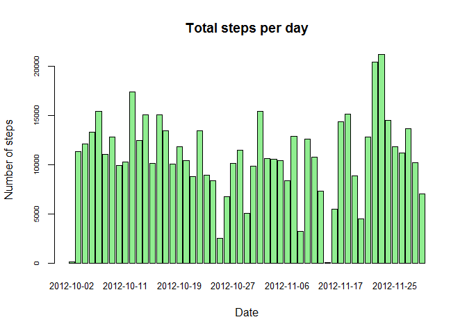
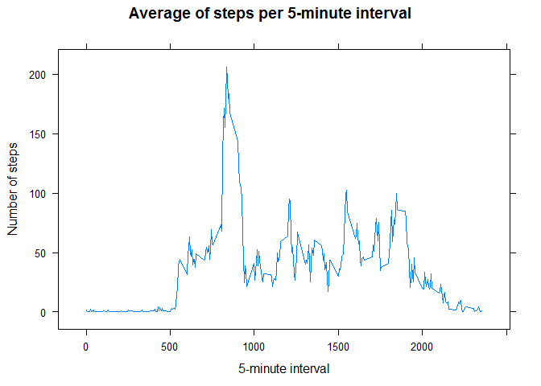
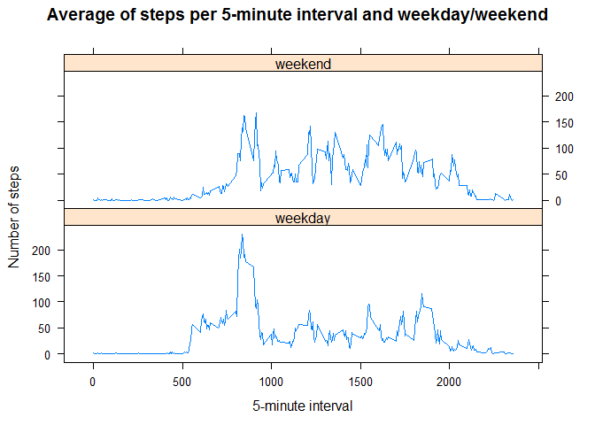

# Reproducible Research: Peer Assessment 1

**Author:** Paulo Sa  
**Github repository:**  
        
* [Source Code](https://github.com/paulorochasa/RepData_PeerAssessment1)
        
* [Knitr HTML rendered](https://github.com/paulorochasa/RepData_PeerAssessment1/PA1_template.html)

## Loading and preprocessing the data


```r
unzip("activity.zip")
activity.data<-read.csv("activity.csv")
activity.tidy<-activity.data[!is.na(activity.data$steps),]
```
## What is mean total number of steps taken per day?
Resume with a **histogram** the total number of steps taken each day


```r
activity.daily.summary<-aggregate(steps ~ date, data=activity.tidy, FUN=sum)
barplot(activity.daily.summary$steps, names.arg=activity.daily.summary$date, xlab="Date", ylab="Number of steps", main="Total steps per day",col="lightgreen",cex.axis = 0.6, cex.names = 0.8)
```



**Mean** and **Median** of total number of steps taken per day  

```r
mean(activity.daily.summary$steps)
```

```
## [1] 10766.19
```

```r
median(activity.daily.summary$steps)
```

```
## [1] 10765
```

## What is the average daily activity pattern?

With a time series **lattice plot**, resume daily activity of the 5-minute interval (x-axis) and the average number of steps taken, averaged across all days (y-axis)


```r
activity.interval.summary<-aggregate(steps ~ interval, data=activity.tidy, FUN=mean)

library(lattice)
xyplot(steps~interval, data=activity.interval.summary, type="l", xlab = "5-minute interval", ylab = "Number of steps", main = "Average of steps per 5-minute interval")
```



Which 5-minute interval contains the maximum number of steps

```r
library(dplyr)
```

```r
activity.interval.summary %>% filter(steps==max(steps)) %>% select(interval)
```

```
##   interval
## 1      835
```

## Imputing missing values

Total of missing values (steps with **NA**)

```r
sum(is.na(activity.data))
```

```
## [1] 2304
```

To fill the missing values on dataset, I will update with the average of total 
steps taken per 5-minute interval (round to zero decimal places)


```r
activity.tidy <- merge(activity.data, activity.interval.summary, by = "interval", suffixes = c("",".y"))
activity.nas <- is.na(activity.tidy$steps)
activity.tidy$steps[activity.nas] <- activity.tidy$steps.y[activity.nas]
activity.tidy <- activity.tidy %>% select(steps, date, interval)  %>% arrange(date) %>% mutate(steps=round(steps,0))
```


Make a **histogram** with the total number of steps taken each day and report the **Mean** and **Median** values

```r
activity.daily.summary<-aggregate(steps ~ date, data=activity.tidy, FUN=sum)
barplot(activity.daily.summary$steps, names.arg=activity.daily.summary$date, xlab="Date", ylab="Number of steps", main="Total steps per day",col="lightgreen",cex.axis = 0.6, cex.names = 0.8)
```


```r
mean(activity.daily.summary$steps)
```

```
## [1] 10765.64
```

```r
median(activity.daily.summary$steps)
```

```
## [1] 10762
```

The impact of the missing data seems rather low, however the first day shall contribute to change the general mean values

## Are there differences in activity patterns between weekdays and weekends?

Firstly I create a new column with weekday or weekend

```r
typeofday <- function(date) {
    Sys.setlocale("LC_TIME", "C")
    if (weekdays(as.Date(date)) %in% c("Saturday", "Sunday")) {
        "weekend"
    } else {
        "weekday"
    }
}
activity.tidy$typeofday <- as.factor(sapply(activity.tidy$date, typeofday))
```


With a time series **lattice plot**, resume daily activity per day type (**weekday** or **weekend**) of the 5-minute interval (x-axis) and the average number of steps taken, averaged across all days (y-axis) 


```r
activity.interval.summary<-aggregate(steps ~ interval + typeofday, data=activity.tidy, FUN=mean)

xyplot(steps~interval|typeofday, data=activity.interval.summary, type="l", xlab = "5-minute interval", ylab = "Number of steps", main = "Average of steps per 5-minute interval and weekday/weekend",layout=(c(1,2)))
```


